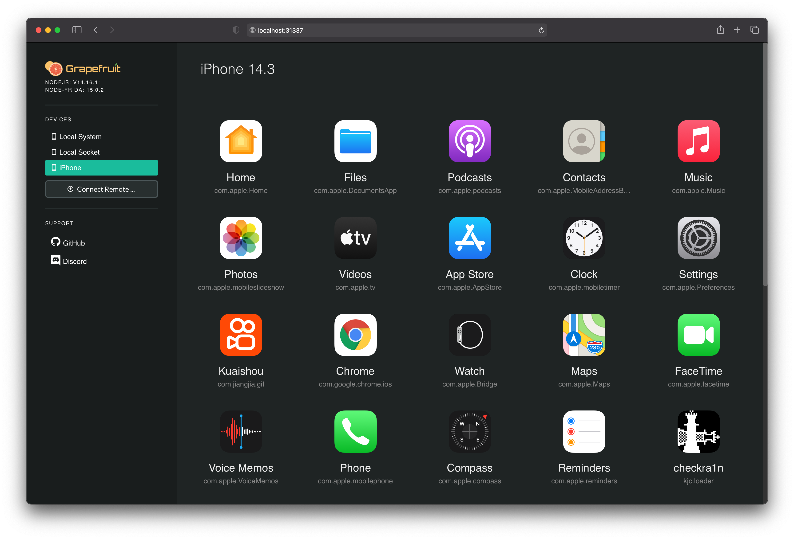

# Grapefruit: Runtime Application Instruments for iOS

[](https://discord.com/invite/pwutZNx)
[](https://www.npmjs.com/package/igf)
[](https://github.com/ChiChou/Grapefruit/commits/master)
[](https://github.com/ChiChou/Grapefruit/graphs/contributors)
[](https://github.com/ChiChou/Grapefruit/blob/master/LICENSE)



## 🚀 Quick Start (Zero Configuration)

```bash
git clone https://github.com/obfuscate-d/grapefruit-pro-max.git
cd grapefruit-pro-max
./grapefruit.sh
```

**That's it!** The master script handles everything automatically and starts the server at `http://localhost:31337`

## Prerequisites

- **Node.js 18.x LTS** - [Download here](https://nodejs.org/)
- **Python 3.8+** - Usually pre-installed on macOS
- **Xcode** - Install from Mac App Store (for iOS Developer Disk Image)
- **iOS Device** - Jailbroken with Frida OR non-jailbroken with Xcode debugging

## Master Script Options

```bash
./grapefruit.sh                 # Full setup + start server
./grapefruit.sh --check-only    # Verify setup without starting
./grapefruit.sh --force-rebuild # Clean rebuild everything
./grapefruit.sh --kill-existing # Stop existing server first
./grapefruit.sh --help          # Show all options
```

## iOS Device Setup

### Jailbroken Device
1. Install Cydia
2. Add Frida's repository: `https://build.frida.re`
3. Install the "Frida" package
4. Connect via USB

### Non-Jailbroken Device
1. Connect to Mac via USB
2. Open Xcode briefly (mounts iOS Developer Disk Image)
3. Device will appear in Grapefruit

## Troubleshooting

**"Port 31337 in use":**
```bash
./grapefruit.sh --kill-existing
```

**"Build failed":**
```bash
./grapefruit.sh --force-rebuild
```

**"iOS device not detected":**
- Connect via USB and trust the device
- Open Xcode to mount developer disk image
- For jailbroken devices, ensure Frida is installed

## What the Master Script Does

- ✅ Creates Python virtual environment
- ✅ Installs Frida tools via pip
- ✅ Installs all Node.js dependencies
- ✅ Builds server, GUI, and agent components
- ✅ Detects connected iOS devices
- ✅ Starts web server at http://localhost:31337

## Alternative Installation

For traditional npm installation: `npm install -g igf`

## Security Warning

Grapefruit has no authentication. Limit access to `localhost` and trusted networks only.

## Credits & Attribution

This is an enhanced fork of [Grapefruit](https://github.com/ChiChou/Grapefruit) by CodeColorist, with additional fixes and automation for Node.js 18+ compatibility and team distribution.

**Original Project:** [ChiChou/Grapefruit](https://github.com/ChiChou/Grapefruit)  
**License:** MIT License  
**Enhancements:** ESM compatibility, automated setup script, Node.js 18+ support

## Links

* [Discord Community](https://discord.gg/pwutZNx)
* [Troubleshooting Wiki](https://github.com/ChiChou/grapefruit/wiki/Trouble-Shooting)
* [Project Roadmap](https://github.com/ChiChou/Grapefruit/projects/1)
